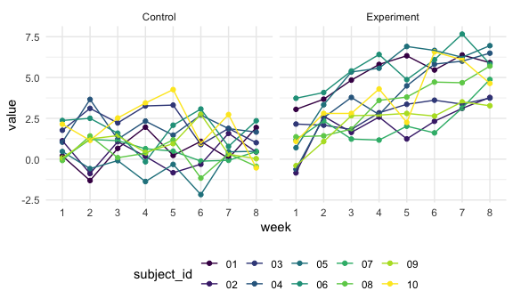

p8105\_hw5\_yf2563
================
Yatong Feng
11/18/2020

## Problem 0 - Setup

``` r
library(tidyverse)
library(stringr)

knitr::opts_chunk$set(
  message = F,
  warning = F,
  fig.width = 6,
  fig.asp = .6,
  out.width = "90%"
)
theme_set(theme_minimal() + theme(legend.position = "bottom"))
options(
  ggplot2.continuous.colour = "viridis",
  ggplot2.continuous.fill = "viridis"
)
scale_colour_discrete = scale_color_viridis_d
scale_fill_discrete = scale_fill_viridis_d
```

## Problem 1

#### 1.1.1

Describe the raw data.

``` r
homicide_raw_df = 
  read_csv("data-homicides/homicide-data.csv")
```

**Brief Introduction:**

  - The data included the location of the killing, whether an arrest was
    made and, in most cases, basic demographic information about each
    victim.
  - The dimension of this resulting dataset is (52179, 12), which means
    that, there are 52179 observations and 12 variables.
  - The variables include city, disposition, lat, lon, reported\_date,
    state, uid, victim\_age, victim\_first, victim\_last, victim\_race,
    victim\_sex.

**Create a city\_state variable:**

``` r
homicide_df = 
  homicide_raw_df %>% 
  mutate(
    city_state = str_c(city, state, sep = "_"),
    resolved = case_when(
      disposition == "Closed without arrest" ~ "unsolved",
      disposition == "Open/No arrest"        ~ "unsolved",
      disposition == "Closed by arrest"      ~ "solved",
    )
  ) %>% 
  select(city_state, resolved) %>% 
  filter(city_state != "Tulsa_AL")
```

#### 1.1.2

Summarize within cities to obtain the total number of homicides and the
number of unsolved homicides

``` r
aggregate_df = 
  homicide_df %>% 
  group_by(city_state) %>% 
  summarize(
    hom_total = n(),
    hom_unsolved = sum(resolved == "unsolved")
  )

aggregate_df
```

    ## # A tibble: 50 x 3
    ##    city_state     hom_total hom_unsolved
    ##    <chr>              <int>        <int>
    ##  1 Albuquerque_NM       378          146
    ##  2 Atlanta_GA           973          373
    ##  3 Baltimore_MD        2827         1825
    ##  4 Baton Rouge_LA       424          196
    ##  5 Birmingham_AL        800          347
    ##  6 Boston_MA            614          310
    ##  7 Buffalo_NY           521          319
    ##  8 Charlotte_NC         687          206
    ##  9 Chicago_IL          5535         4073
    ## 10 Cincinnati_OH        694          309
    ## # … with 40 more rows

#### 1.2

For the city of Baltimore, MD, use the prop.test function to estimate
the proportion of homicides that are unsolved; save the output of
prop.test as an R object, apply the broom::tidy to this object and pull
the estimated proportion and confidence intervals from the resulting
tidy dataframe.

``` r
prop.test(
  aggregate_df %>% filter(city_state == "Baltimore_MD") %>% pull(hom_unsolved), 
  aggregate_df %>% filter(city_state == "Baltimore_MD") %>% pull(hom_total)) %>% 
  broom::tidy()
```

    ## # A tibble: 1 x 8
    ##   estimate statistic  p.value parameter conf.low conf.high method    alternative
    ##      <dbl>     <dbl>    <dbl>     <int>    <dbl>     <dbl> <chr>     <chr>      
    ## 1    0.646      239. 6.46e-54         1    0.628     0.663 1-sample… two.sided

#### 1.3

Now run prop.test for each of the cities in your dataset, and extract
both the proportion of unsolved homicides and the confidence interval
for each. Do this within a “tidy” pipeline, making use of purrr::map,
purrr::map2, list columns and unnest as necessary to create a tidy
dataframe with estimated proportions and CIs for each city.

``` r
results_df = 
  aggregate_df %>% 
  mutate(
    prop_tests = map2(.x = hom_unsolved, .y = hom_total, ~prop.test(x = .x, n = .y)),
    tidy_tests = map(.x = prop_tests, ~broom::tidy(.x))
  ) %>% 
  select(-prop_tests) %>% 
  unnest(tidy_tests) %>% 
  select(city_state, estimate, conf.low, conf.high)

results_df
```

    ## # A tibble: 50 x 4
    ##    city_state     estimate conf.low conf.high
    ##    <chr>             <dbl>    <dbl>     <dbl>
    ##  1 Albuquerque_NM    0.386    0.337     0.438
    ##  2 Atlanta_GA        0.383    0.353     0.415
    ##  3 Baltimore_MD      0.646    0.628     0.663
    ##  4 Baton Rouge_LA    0.462    0.414     0.511
    ##  5 Birmingham_AL     0.434    0.399     0.469
    ##  6 Boston_MA         0.505    0.465     0.545
    ##  7 Buffalo_NY        0.612    0.569     0.654
    ##  8 Charlotte_NC      0.300    0.266     0.336
    ##  9 Chicago_IL        0.736    0.724     0.747
    ## 10 Cincinnati_OH     0.445    0.408     0.483
    ## # … with 40 more rows

#### 1.4

Create a plot that shows the estimates and CIs for each city – check out
geom\_errorbar for a way to add error bars based on the upper and lower
limits. Organize cities according to the proportion of unsolved
homicides.

``` r
results_df %>% 
  mutate(city_state = fct_reorder(city_state, estimate)) %>% 
  ggplot(aes(x = city_state, y = estimate)) +
  geom_point() + 
  geom_errorbar(aes(ymin = conf.low, ymax = conf.high)) + 
  theme(axis.text.x = element_text(angle = 90, vjust = 0.5, hjust = 1))
```


## Problem 2

longitudinal study: include a control arm and an experimental arm. Data
for each participant is included in a separate file, and file names
include the subject ID and arm.

#### 2.1

Create a tidy dataframe containing data from all participants, including
the subject ID, arm, and observations over time:

  - dataframe: containing all file names (list.files function)
  - Iterate over file names, read in data for each subject (purrr::map)
    and saving the result as a new variable in the dataframe

<!-- end list -->

``` r
path_df = 
  tibble(
    path = list.files("lda_data"),
  ) %>% 
  mutate(
    path = str_c("lda_data/", path),
    map_df(.x = path, read_csv)) %>% 
  bind_cols()

path_df
```

    ## # A tibble: 20 x 9
    ##    path                week_1 week_2 week_3 week_4 week_5 week_6 week_7 week_8
    ##    <chr>                <dbl>  <dbl>  <dbl>  <dbl>  <dbl>  <dbl>  <dbl>  <dbl>
    ##  1 lda_data/con_01.csv   0.2  -1.31    0.66   1.96   0.23   1.09   0.05   1.94
    ##  2 lda_data/con_02.csv   1.13 -0.88    1.07   0.17  -0.83  -0.31   1.58   0.44
    ##  3 lda_data/con_03.csv   1.77  3.11    2.22   3.26   3.31   0.89   1.88   1.01
    ##  4 lda_data/con_04.csv   1.04  3.66    1.22   2.33   1.47   2.7    1.87   1.66
    ##  5 lda_data/con_05.csv   0.47 -0.580  -0.09  -1.37  -0.32  -2.17   0.45   0.48
    ##  6 lda_data/con_06.csv   2.37  2.5     1.59  -0.16   2.08   3.07   0.78   2.35
    ##  7 lda_data/con_07.csv   0.03  1.21    1.13   0.64   0.49  -0.12  -0.07   0.46
    ##  8 lda_data/con_08.csv  -0.08  1.42    0.09   0.36   1.18  -1.16   0.33  -0.44
    ##  9 lda_data/con_09.csv   0.08  1.24    1.44   0.41   0.95   2.75   0.3    0.03
    ## 10 lda_data/con_10.csv   2.14  1.15    2.52   3.44   4.26   0.97   2.73  -0.53
    ## 11 lda_data/exp_01.csv   3.05  3.67    4.84   5.8    6.33   5.46   6.38   5.91
    ## 12 lda_data/exp_02.csv  -0.84  2.63    1.64   2.58   1.24   2.32   3.11   3.78
    ## 13 lda_data/exp_03.csv   2.15  2.08    1.82   2.84   3.36   3.61   3.37   3.74
    ## 14 lda_data/exp_04.csv  -0.62  2.54    3.78   2.73   4.49   5.82   6      6.49
    ## 15 lda_data/exp_05.csv   0.7   3.33    5.34   5.57   6.9    6.66   6.24   6.95
    ## 16 lda_data/exp_06.csv   3.73  4.08    5.4    6.41   4.87   6.09   7.66   5.83
    ## 17 lda_data/exp_07.csv   1.18  2.35    1.23   1.17   2.02   1.61   3.13   4.88
    ## 18 lda_data/exp_08.csv   1.37  1.43    1.84   3.6    3.8    4.72   4.68   5.7 
    ## 19 lda_data/exp_09.csv  -0.4   1.08    2.66   2.7    2.8    2.64   3.51   3.27
    ## 20 lda_data/exp_10.csv   1.09  2.8     2.8    4.3    2.25   6.57   6.09   4.64

  - Tidy the result; manipulate file names to include control arm and
    subject ID, make sure weekly observations are “tidy”, and do any
    other tidying that’s necessary

<!-- end list -->

``` r
prob2_tidy_df = 
  path_df %>% 
  mutate(path = str_sub(path, 10, -5)) %>% 
  separate(path,
           into = c("control_arm", "subject_id"),
           sep = "_") %>% 
  mutate(control_arm = case_when(
    control_arm == "con" ~ "Control",
    control_arm == "exp" ~ "Experiment"
  )) %>% 
  pivot_longer(
    week_1:week_8,
    names_to = "week",
    values_to = "value")

prob2_tidy_df
```

    ## # A tibble: 160 x 4
    ##    control_arm subject_id week   value
    ##    <chr>       <chr>      <chr>  <dbl>
    ##  1 Control     01         week_1  0.2 
    ##  2 Control     01         week_2 -1.31
    ##  3 Control     01         week_3  0.66
    ##  4 Control     01         week_4  1.96
    ##  5 Control     01         week_5  0.23
    ##  6 Control     01         week_6  1.09
    ##  7 Control     01         week_7  0.05
    ##  8 Control     01         week_8  1.94
    ##  9 Control     02         week_1  1.13
    ## 10 Control     02         week_2 -0.88
    ## # … with 150 more rows

  - Make a spaghetti plot showing observations on each subject over
    time, and comment on differences between groups.

<!-- end list -->

``` r
prob2_tidy_df %>% 
  mutate(week = str_replace(week, "week_", "")) %>%
  ggplot(aes(x = week, y = value, group = subject_id, color = subject_id)) +
  geom_point() +
  geom_line() +
  facet_grid(~control_arm)
```



The control and experiment group have different trend. - For the control
group: relatively stable around 1.25. - For the expose group: increasing
trend over time.

## Problem 3

When designing an experiment or analysis, a common question is whether
it is likely that a true effect will be detected – put differently,
whether a false null hypothesis will be rejected. The probability that a
false null hypothesis is rejected is referred to as power, and it
depends on several factors, including: the sample size; the effect size;
and the error variance. In this problem, you will conduct a simulation
to explore power in a one-sample t-test.

First set the following design elements:

Fix n=30, sigma=5, mu=0. Generate 5000 datasets from the model

``` r
simulation <- function(mu, sd = 5, sample_size = 30, iteration = 5000){
  
  tibble(
    sample_id = 1:iteration,
    data = rerun(iteration, rnorm(n = 30, mean = 0, sd = 5))) %>% 
    mutate(t_test = map(.x = data, ~t.test(.x, mu = mu))) %>% 
    mutate(result = map(.x = t_test, ~broom::tidy(.x))) %>% 
    select(sample_id, result) %>%
    unnest(result) %>% 
    mutate(mu = rep(mu, iteration)) %>% 
    select(mu, sample_id, estimate, p.value) %>% 
    mutate(decision = case_when(
      p.value < 0.05 ~ "Reject",
      p.value >= 0.05 ~ "Fail to Reject"))
}

output = map_dfr(1:6, simulation)

output
```

    ## # A tibble: 30,000 x 5
    ##       mu sample_id estimate p.value decision      
    ##    <int>     <int>    <dbl>   <dbl> <chr>         
    ##  1     1         1   0.654   0.717  Fail to Reject
    ##  2     1         2   0.869   0.872  Fail to Reject
    ##  3     1         3   2.22    0.170  Fail to Reject
    ##  4     1         4  -0.820   0.0925 Fail to Reject
    ##  5     1         5   0.256   0.367  Fail to Reject
    ##  6     1         6  -0.267   0.151  Fail to Reject
    ##  7     1         7   0.0143  0.338  Fail to Reject
    ##  8     1         8  -0.444   0.207  Fail to Reject
    ##  9     1         9   1.29    0.657  Fail to Reject
    ## 10     1        10  -0.140   0.214  Fail to Reject
    ## # … with 29,990 more rows

  - Make a plot showing the proportion of times the null was rejected
    (the power of the test) on the y axis and the true value of mu on
    the x axis. Describe the association between effect size and power.
  - Make a plot showing the average estimate of mu on the y axis and the
    true value of mu on the x axis. Make a second plot (or overlay on
    the first) the average estimate of mu only in samples for which the
    null was rejected on the y axis and the true value of mu on the x
    axis. Is the sample average of mu across tests for which the null is
    rejected approximately equal to the true value of mu? Why or why
    not?
